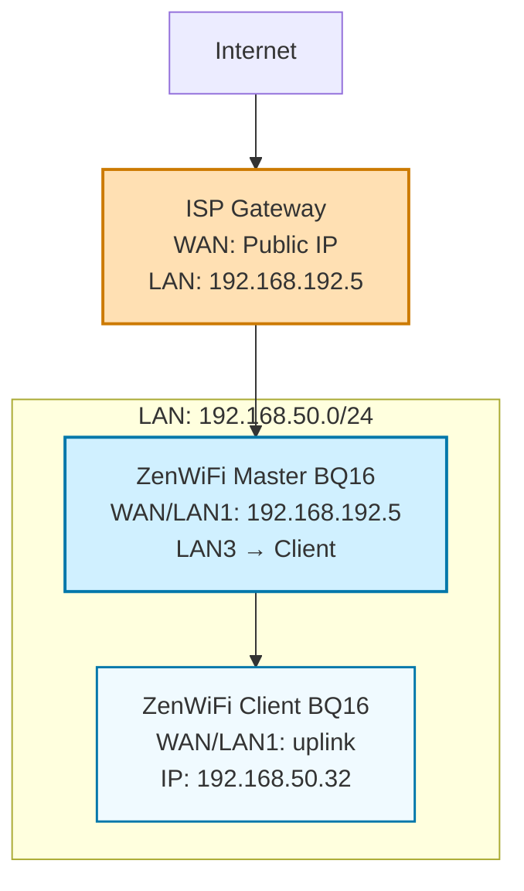

# Architecture

```mermaid
flowchart TD
    A[Internet] --> B[ISP Gateway<br/>WAN: Public IP<br/>LAN: 192.168.192.5]
    B --> C[ZenWiFi Master BQ16<br/>WAN/LAN1: 192.168.192.5<br/>LAN3 → Client]
    C --> D[ZenWiFi Client BQ16<br/>WAN/LAN1: uplink<br/>IP: 192.168.50.32]
    
    subgraph LAN Network [LAN: 192.168.50.0/24]
        C
        D
    end

    style C fill:#d0f0ff,stroke:#0077aa,stroke-width:2px
    style D fill:#f0faff,stroke:#0077aa,stroke-width:1.5px
    style B fill:#ffe0b3,stroke:#cc7a00,stroke-width:2px


```
