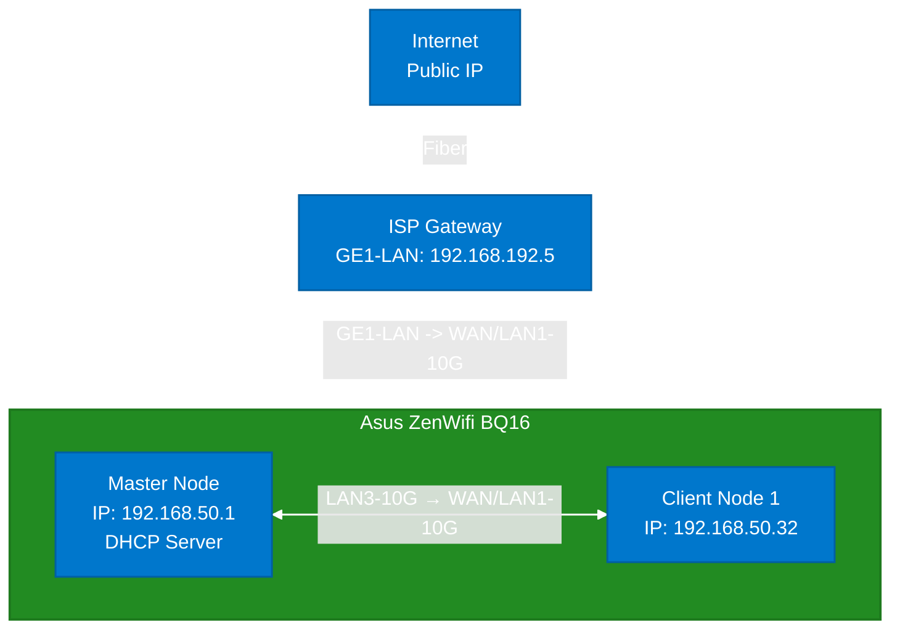

# Architecture

```mermaid
flowchart TD
    A[Internet<br/>Public IP] <-->|Fiber| B[ISP Gateway<br/>GE1-LAN: 192.168.192.5]
    B <-->|GE1-LAN -> WAN/LAN1-10G| ZW[Asus ZenWifi BQ16]

    subgraph ZW [Asus ZenWifi BQ16]
        C[Master Node<br/>IP: 192.168.50.1<br/>DHCP Server]
        D[Client Node 1<br/>IP: 192.168.50.32<br/>]
        C <-->|LAN3-10G → WAN/LAN1-10G| D
    end

    %% Styling
    style A fill:#0077cc,color:#ffffff,stroke:#005fa3,stroke-width:1.5px
    style B fill:#0077cc,color:#ffffff,stroke:#005fa3,stroke-width:1.5px
    style C fill:#0077cc,color:#ffffff,stroke:#005fa3,stroke-width:1.5px
    style D fill:#0077cc,color:#ffffff,stroke:#005fa3,stroke-width:1.5px
    style ZW fill:#228b22,color:#ffffff,stroke:#1e7a1e,stroke-width:2px

    linkStyle 0 stroke:#ffffff,stroke-width:1.5px,color:#ffffff
    linkStyle 1 stroke:#ffffff,stroke-width:1.5px,color:#ffffff
    linkStyle 2 stroke:#ffffff,stroke-width:1.5px,color:#ffffff
```
