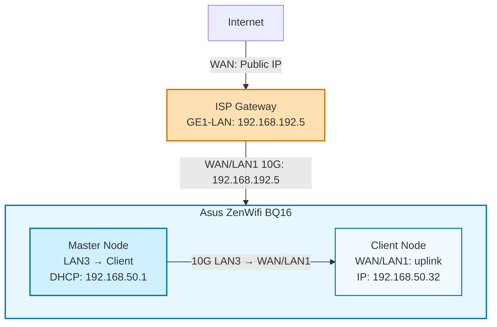

# Architecture

```mermaid
flowchart TD
    A[Internet] -->|WAN: Public IP| B[ISP Gateway<br/>GE1-LAN: 192.168.192.5]
    B -->|WAN/LAN1 10G: 192.168.192.5| ZW[Asus ZenWifi BQ16]

    subgraph ZW [Asus ZenWifi BQ16]
        C[Master Node<br/>LAN3 → Client<br/>DHCP: 192.168.50.1]
        D[Client Node<br/>WAN/LAN1: uplink<br/>IP: 192.168.50.32]
        C -->|10G LAN3 → WAN/LAN1| D
    end

    style ZW fill:#e6f7ff,stroke:#0077aa,stroke-width:2px
    style C fill:#d0f0ff,stroke:#0077aa,stroke-width:2px
    style D fill:#f0faff,stroke:#0077aa,stroke-width:1.5px
    style B fill:#ffe0b3,stroke:#cc7a00,stroke-width:2px
```
