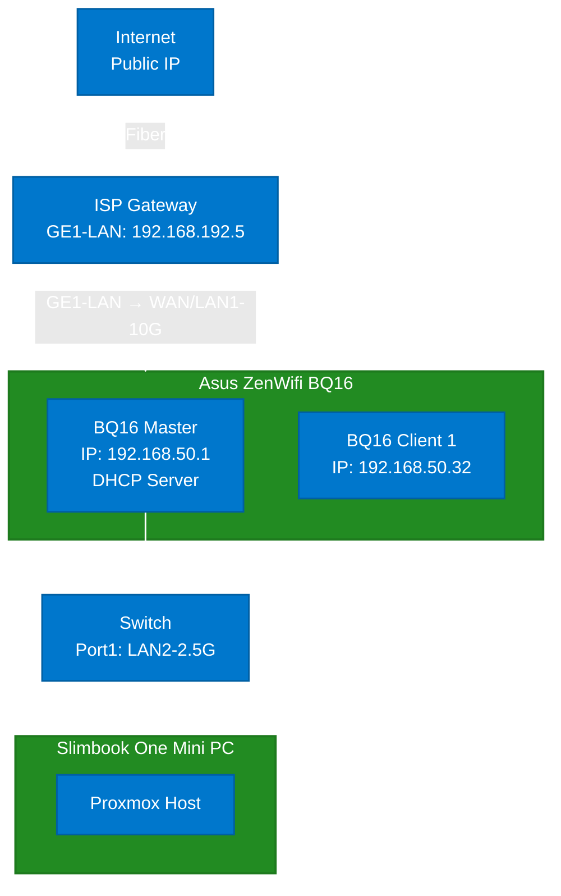

# Architecture

```mermaid
flowchart TD
    A[Internet<br/>Public IP] <-->|Fiber| B[ISP Gateway<br/>GE1-LAN: 192.168.192.5]
    B <-->|GE1-LAN → WAN/LAN1-10G| ZW

    %% ZenWifi groep met horizontale layout
    subgraph ZW [Asus ZenWifi BQ16]
        direction LR
        C[BQ16 Master<br/>IP: 192.168.50.1<br/>DHCP Server]
        D[BQ16 Client 1<br/>IP: 192.168.50.32]
    end

    %% Switch onder Master
    C --> S[Switch<br/>Port1: LAN2-2.5G]
    S --> SLIM[Mini PC: Slimbook One<br/>IP: 192.168.50.x<br/>OS: Proxmox]

    %% Slimbook groep
    subgraph SLIM [Slimbook One Mini PC]
        P[Proxmox Host]
        %% Hier komen later de VM's
    end

    %% Styling
    style A fill:#0077cc,color:#ffffff,stroke:#005fa3,stroke-width:1.5px
    style B fill:#0077cc,color:#ffffff,stroke:#005fa3,stroke-width:1.5px
    style C fill:#0077cc,color:#ffffff,stroke:#005fa3,stroke-width:1.5px
    style D fill:#0077cc,color:#ffffff,stroke:#005fa3,stroke-width:1.5px
    style S fill:#0077cc,color:#ffffff,stroke:#005fa3,stroke-width:1.5px
    style SLIM fill:#228b22,color:#ffffff,stroke:#1e7a1e,stroke-width:2px
    style ZW fill:#228b22,color:#ffffff,stroke:#1e7a1e,stroke-width:2px
    style P fill:#0077cc,color:#ffffff,stroke:#005fa3,stroke-width:1.5px

    linkStyle default stroke:#ffffff,stroke-width:1.5px,color:#ffffff
```
